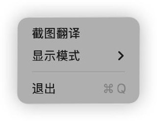
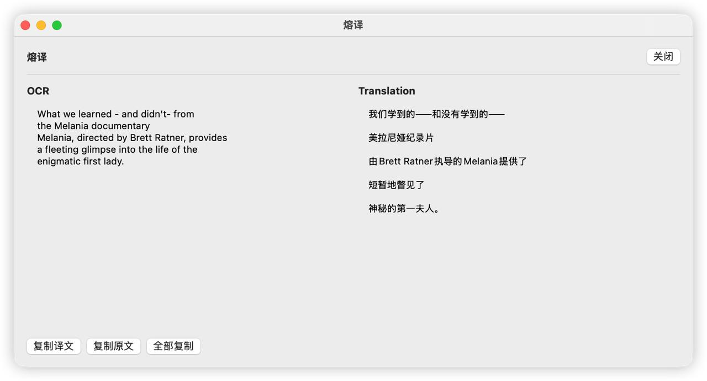

# MoltShot（熔译）— 截图 OCR 翻译（macOS）

一个 **菜单栏 App**：全局快捷键/菜单栏触发 → 框选截图 → OCR 识别 → 自动判断语言（中文→英文；其他→中文）→ 弹出结果并可一键复制。

> 说明：本项目使用 macOS 14+（含 Translation 框架）。翻译可离线使用，但**首次可能需要系统下载离线语言包**。

## 功能
- 全局快捷键触发截图（默认：`⌘⇧2`）
- 框选区域截图
- OCR 识别
- 自动语言检测 + 翻译
- 结果弹窗：原文/译文展示 + 一键复制

## 系统要求
- macOS 14.0+（建议 14.8+）
- Xcode（推荐最新稳定版）

## 构建与运行

### 方式 A：直接用 Xcode（推荐）
1. 打开 `MoltShot.xcodeproj`
2. 选择 target：`MoltShot`
3. Signing & Capabilities（建议配置）：
   - App Sandbox ✅
     - Screen Recording ✅（必须，否则无法截图）
     - Network (Outgoing) ✅（Translation 可能触发语言包下载；离线后也建议保留）
4. Run（⌘R）启动

### 方式 B：用 XcodeGen（可选）
仓库包含 `project.yml`，你也可以：
```bash
brew install xcodegen
xcodegen generate
open MoltShot.xcodeproj
```

## 权限设置（非常重要）
首次运行后：
1. 系统设置 → 隐私与安全性 → **屏幕录制**
2. 勾选 `MoltShot`
3. 重新启动 App（必要时重启 Xcode/重启 App）

## 离线翻译语言包
- 第一次翻译时系统可能提示下载语言资源（或在后台下载）。
- 如果发现翻译失败/一直转圈：
  - 确认网络可用一次
  - 稍等几分钟再试

## 使用
- 全局热键：`⌘⇧2`
- 或菜单栏图标 → Capture
- 框选区域后松开鼠标：弹出原文 + 译文

## 截图

- 
- 

## Roadmap
- 多显示器/Retina 坐标映射进一步完善
- 历史记录
- 翻译方向手动选择（强制中→英/英→中）
- 可选：自动复制译文到剪贴板/通知中心提示

## License
MIT — 见 [LICENSE](./LICENSE)
